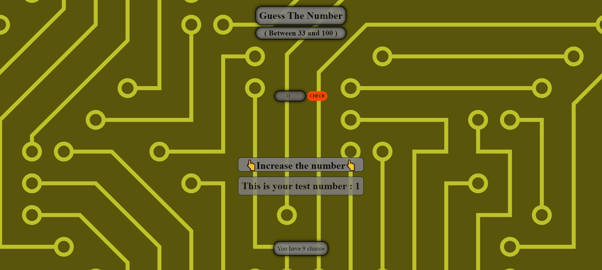

# Guess The Number

This is a simple web application. The game involves the user trying to guess a randomly selected number within a specific range (between 0 and 100).

## How to Play?

1. Open the "index.html" file in your browser.
2. Enter a number and click the "Check" button.
3. If the entered number is equal to the randomly selected number, congratulations! You guessed correctly.
4. If the entered number is smaller than the randomly selected number, the message "👆Increase the number👆" is displayed.
5. If the entered number is larger than the randomly selected number, the message "👇Reduce the number👇" is displayed.
6. The total number of guesses is displayed. Your chances decrease with each guess.
7. When you run out of guesses, the game ends.

## Playing Again

After the game ends, you can restart the game by clicking the "Again" button.
## Live Demo

Check out the live demo [here](https://guess01-i3w2.vercel.app/).

## Features

- User-friendly interface.
- Game sound effects.
- A simple and fun gaming experience.
## Technologies Used

- HTML
- CSS
- JavaScript

## Screenshots

## Contributing

If you would like to contribute, please submit a pull request. Feel free to add improvements or new features.

## License

This project is licensed under the MIT License. See the [LICENSE](LICENSE) file for more information.

